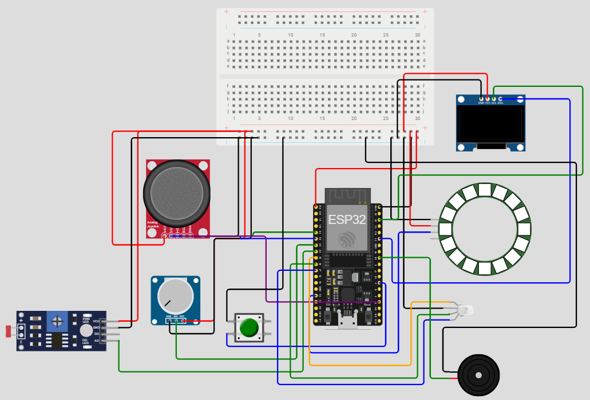
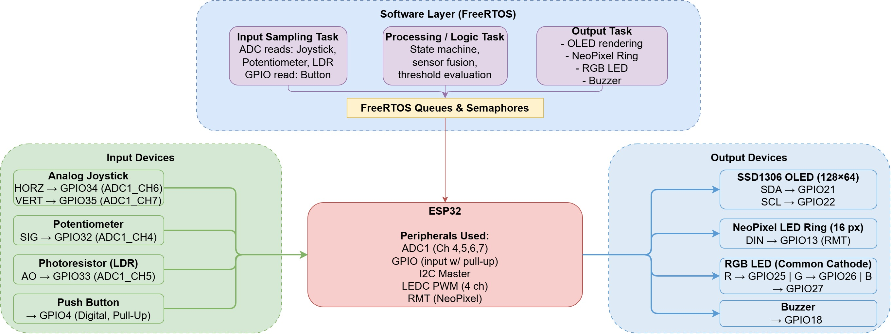
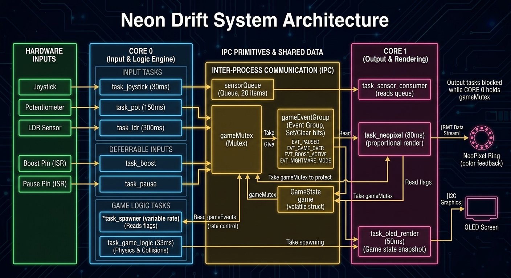
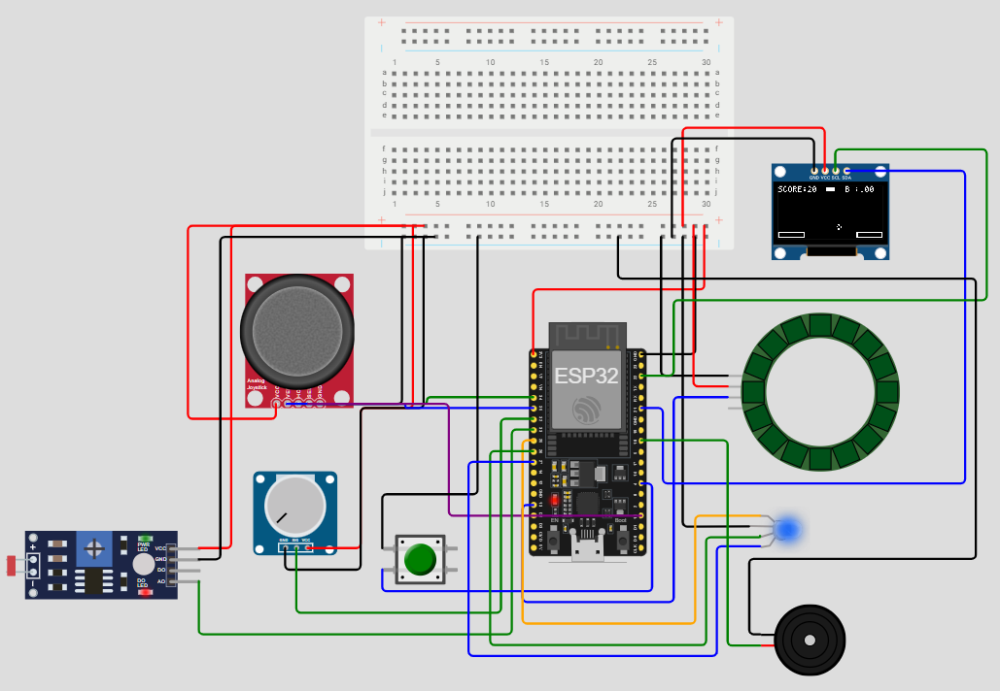
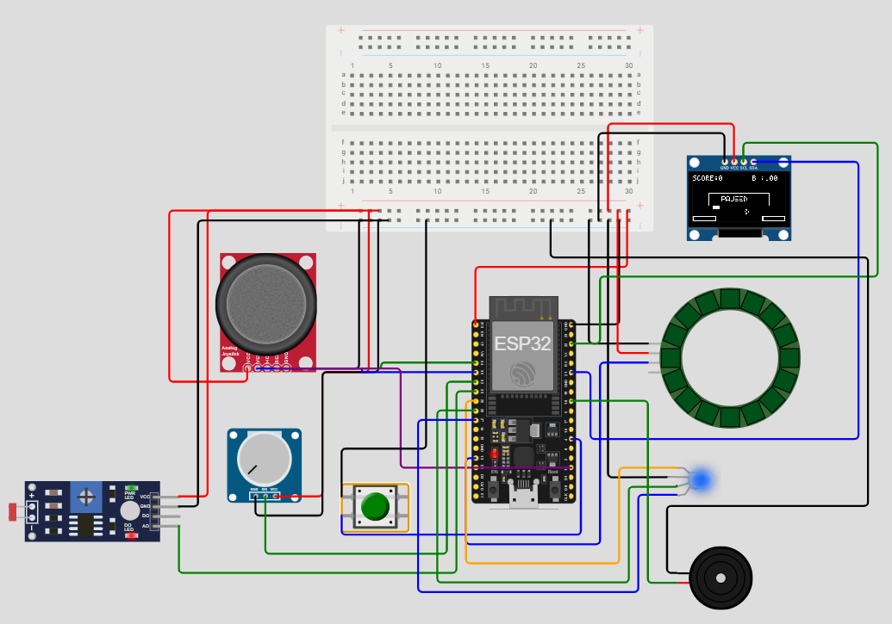
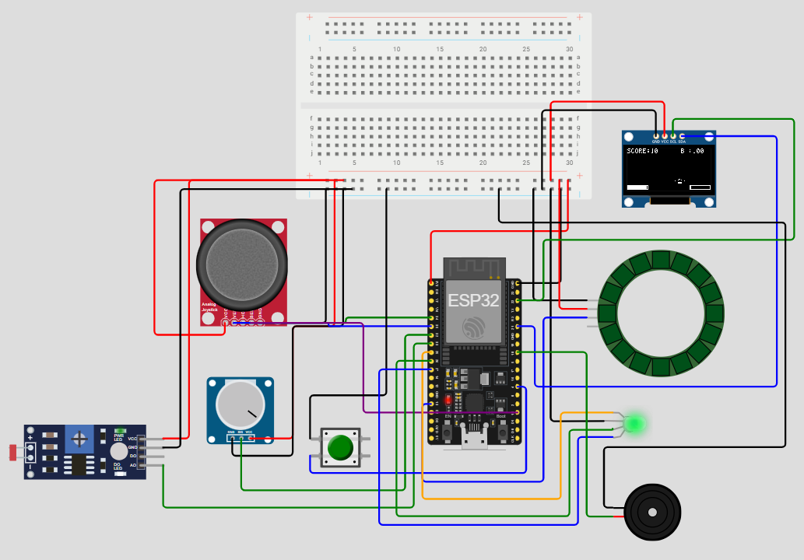
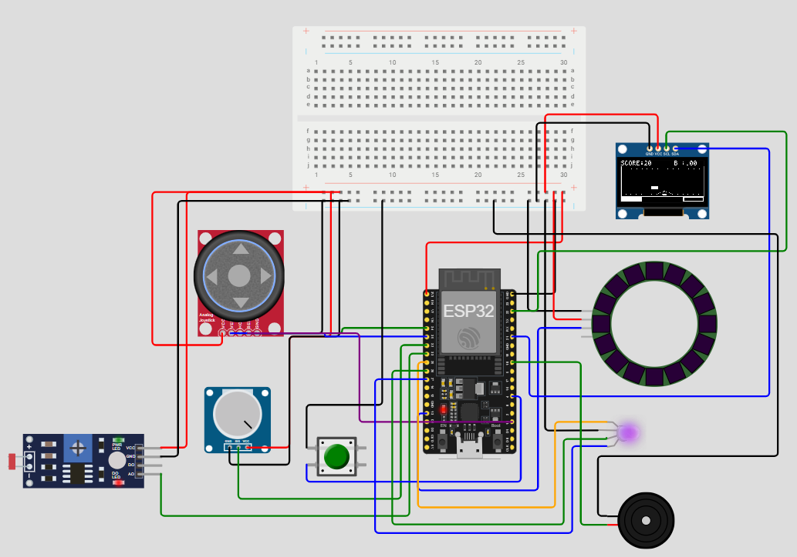
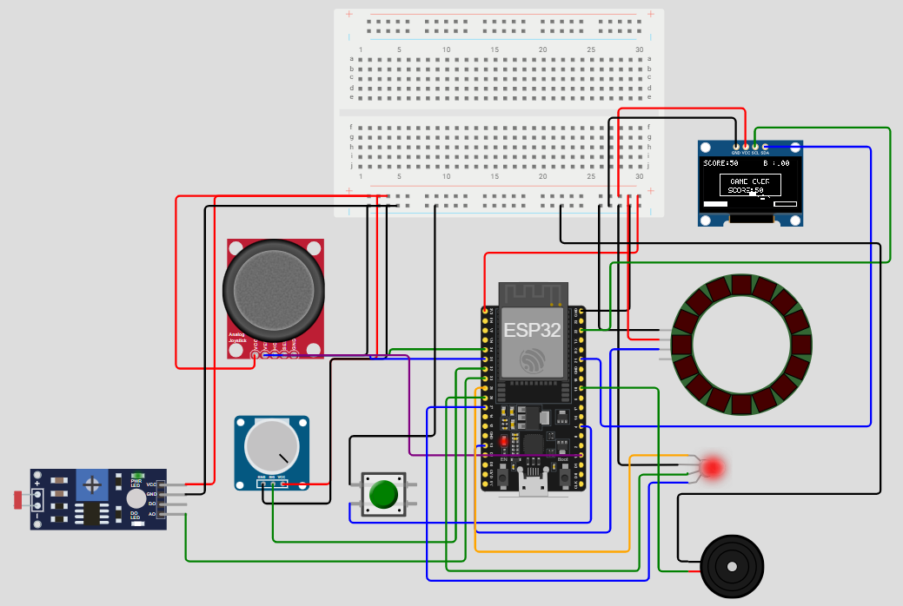

# NEON DRIFT

## Group information

### Section number: 02
### Group number: 01

### Team members

| Name                   | AUS ID     |
| ---------------------- | ---------- |
| Rizwanul Abidin Asim   | b00099449  |
| Ahmad Saad             | b00089723  |
| Mohammed Munzir        | b00093456  |

## Project Description

The project Neon Drift is an interactive embedded systems game developed using an ESP32 microcontroller in a simulated environment (Wokwi and PlatformIO). The game consists of a ship that must avoid randomly appearing obstacles in order to progress throughout the game, obstacle avoidance is done using a joystick and buttons. The main objective of the project is to design a real-time, sensor-driven gaming system that integrates multiple inputs and outputs while demonstrating key embedded concepts such as FreeRTOS multitasking, interrupts, and hardware interfacing.

The game allows the player to control a spaceship navigating through a dynamic obstacle field, where gameplay behavior is influenced by various sensors including a joystick, potentiometer, push button, and LDR. These inputs directly affect movement, speed boost, shield behavior, and game difficulty, while outputs such as an OLED display, NeoPixel ring, RGB LED, and buzzer provide visual and audio feedback.

## System Diagram

## How it works

Hardware/Software Block Diagram:

Software Architecture Diagram:

## Project Impact

The goal of NEON DRIFT is an interactive real-time game simulation, which combines FreeRTOS concepts with real hardware. This project is a retro take on gaming, going back to real hardware with tactile feel rather than mobile gaming. The game runs and schedules multiple tasks on the ESP32 using FreeRTOS preventing race conditions. It also handlles inputs using interrupts effectively and offers a responsive feel to users.

The actual impact of the game lies in applying theory concepts into a fully functional game, combining several concepts. The application of this game will help us in future to build properly responsive and real-time projects, in fields such as automotives and medical instruments.

## FreeRTOS Implementation

### Tasks

| Task name              | Priority | What it does                                                                            | Time constraint                |
| ---------------------- | -------- | --------------------------------------------------------------------------------------- | ------------------------------ |
| `task_joystick`        | 7        | Reads the user input, applies dead zone and 5-sample moving average filter, pushes to queue   | Periodic, every 30 ms          |
| `task_sensor_consumer` | 6        | Drains `sensorQueue` and applies updates to `GameState` under mutex                     | Event driven (blocks on queue) |
| `task_game_logic`      | 6        | Game Physics loop: moves obstacles, collision detection, scoring, sets game over flag   | Periodic, every 33 ms |
| `task_boost`           | 5        | Drains boost energy while button held, sets BOOST_ACTIVE event bit                      | Event driven (semaphore + 100ms while held) |
| `task_pause`           | 5        | Toggles PAUSED event bit on button press.                               | Event driven (semaphore)       |
| `task_oled_render`     | 4        | Snapshots state under mutex, draws to OLED framebuffer, drives RGB LED and buzzer       | Periodic, every 50 ms          |
| `task_spawner`         | 4        | Spawns new obstacles at a rate dependent on the game mode flags                                  | Periodic, 500 to 1500 ms       |
| `task_pot`             | 3        | Reads potentiometer, scales to ship width and shield phase                              | Periodic, every 150 ms         |
| `task_neopixel`        | 3        | Drives the NeoPixel ring proportional to `boostEnergy`, color depends on mode                | Periodic, every 80 ms          |
| `task_ldr`             | 2        | Reads LDR, pushes raw value to queue for nightmare mode threshold check                 | Periodic, every 300 ms         |

Tasks are placed on two different cores: input and game logic on Core 0, output and rendering on Core 1.

### Task Communication and Synchronization

| Name          | Type             | Purpose                                                                                            |
| ------------------ | ---------------- | -------------------------------------------------------------------------------------------------- |
| `gameMutex`        | Mutex            | Protects the shared `GameState`.        |
| `boostSemaphore`   | Binary semaphore | Signaled from the joystick button ISR, where the task_boost is waiting on it.   |
| `pauseSemaphore`   | Binary semaphore | Signaled from the pause button ISR, where the task_pause is waiting on it.                                            |
| `sensorQueue`      | Queue (size 20)  | Ensures a consumer producer relation within the game, where sensors act as producers pushing their readings. |
| `gameEventGroup`   | Event group      | Holds four flags: `EVT_BOOST_ACTIVE`, `EVT_NIGHTMARE_MODE`, `EVT_GAME_OVER`, `EVT_PAUSED`. Any task can check a bit without locking. |

## Screenshots

Gameplay under Initialization conditions:

Gameplay under Pause condition:

Gameplay with Maximum Spaceship Width:

Gameplay with Maximum Spaceship Width and Nightmare Mode:

Gameplay under Game Over Condition:

## Video

YouTube Link: https://youtu.be/lI5h3QiXsIE
